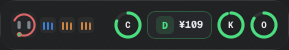
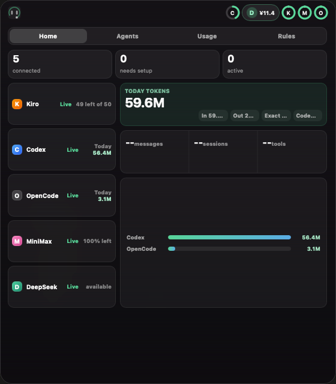
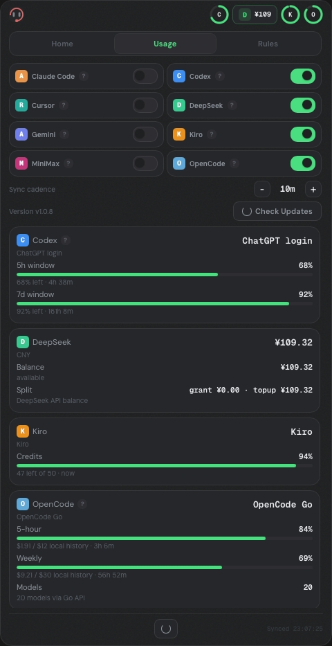
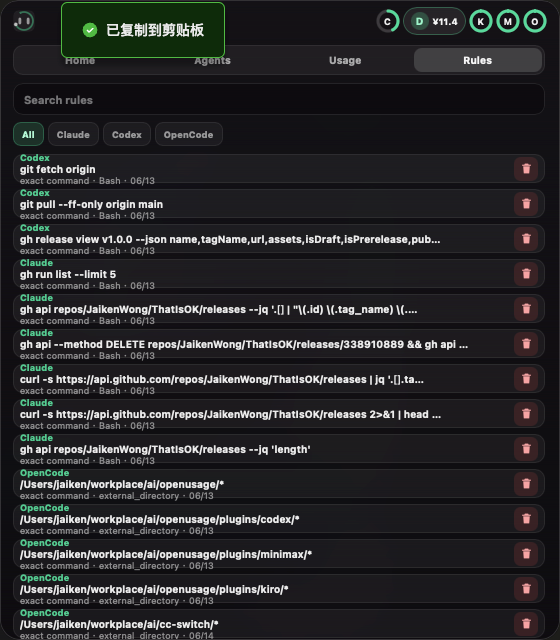
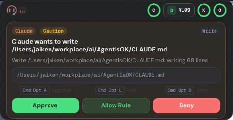

# AgentIsOK

> Desktop approval & usage cockpit for AI coding agents — floating, local, no telemetry.

AgentIsOK is a **floating island** that lives on your desktop. It intercepts permission requests from coding agents, tracks quotas and balances, and shows today’s local token usage in one compact panel.

<p align="center">
  
</p>

<p align="center">
  
  
  
</p>

## What it does

- **Permission approval** — approve, create allow rules, answer ask prompts, or deny tool-use requests without tabbing back to terminal

<p align="center">
  
</p>

- **Home dashboard** — provider health, running agents, exact/estimated token usage, and today’s local activity in one view
- **Usage tracking** — real-time progress bars for 5h / weekly / monthly quotas, credits, balances, and reset times
- **Token accounting** — exact local token usage for Claude, Codex, and OpenCode when their logs expose token data, plus Antigravity local activity
- **Rules manager** — search, filter by agent source, remove rules with undo, and inspect long commands
- **Always on top** — a transparent, draggable island that never gets buried under other windows

## Supported providers

### Approval (hook bridge)

| Agent | Status | Setup |
|-------|--------|-------|
| Claude Code | ✅ | Auto-injected on startup |
| Codex | ✅ | Auto-injected on startup |
| Antigravity | ✅ | Auto-injected into `~/.gemini/config/hooks.json` |
| OpenCode | ✅ | Plugin install required ([see below](#opencode)) |

### Usage & balance

| Provider | Tracks | Token data | Source |
|----------|--------|------------|--------|
| Codex | 5h / 7d rate limits | Exact today tokens from session `token_count` events | Local auth + session files |
| Claude Code | Today messages / sessions / tools | Exact today tokens from JSONL transcripts | Local Claude data |
| Antigravity | Local agent calls / sessions / selected model | Not exposed | Local Antigravity logs (`~/.gemini/antigravity*`) |
| OpenCode Go | $12 / $30 / $60 limits | Exact today tokens from SQLite session/message records | Local SQLite (`opencode.db`) |
| OpenCode Zen | Model availability | Not exposed | OpenCode API key |
| Kiro | Credits | Not exposed | Local Kiro DB |
| DeepSeek | API balance | Not exposed | `DEEPSEEK_API_KEY` |
| MiniMax | Token-plan prompt balance | Not exposed | `MINIMAX_API_KEY` |

## Install

### From release (recommended)

Download the latest `.dmg` (macOS) or `.exe` (Windows) from [Releases](https://github.com/JaikenWong/AgentIsOK/releases).

**macOS users:** the app is not Apple-notarized. After installing, run this once to bypass Gatekeeper:

```bash
xattr -cr /Applications/AgentIsOK.app
```

Alternatively, right-click the app in Finder → **Open**.

### From source

```bash
git clone https://github.com/JaikenWong/AgentIsOK.git
cd AgentIsOK
npm install
npm run tauri:dev     # dev
npm run tauri:build   # release build → src-tauri/target/release/bundle/
```

**Prerequisites:** Node.js 18+, Rust toolchain (rustup), and platform build tools (Xcode on macOS, MSVC on Windows).

## Usage

### The island

| Mode | What you see |
|------|-------------|
| **Collapsed** | Logo + compact provider meters. Click to open the full panel. |
| **Home** | Active agent sessions, provider health, token summaries, timeline detail, and terminal jump target. |
| **Usage** | Provider visibility toggles, sync cadence, version/update check, quota cards, balances, and reset times. |
| **Rules** | Searchable allow-rule list with source filters, command preview, delete icon, and undo. |

### Global shortcuts

| Shortcut | Action |
|----------|--------|
| `Ctrl/Cmd+Shift+Space` | Toggle island visibility |
| `Ctrl/Cmd+Opt+A` | Approve current permission request |
| `Ctrl/Cmd+Opt+L` | Approve always (persistent rule) |
| `Ctrl/Cmd+Opt+D` | Deny current permission request |

### Tray menu

Right-click the tray icon (macOS menu bar / Windows system tray) for **Open**, **Sync Now**, **Install Hooks**, **Remove Hooks**, update status, and **Quit**.

## How hooks work

On startup, AgentIsOK writes managed entries into:

- `~/.claude/settings.json`
- `~/.codex/hooks.json`
- `~/.gemini/config/hooks.json` (Antigravity)

When a tool-use permission is requested, the agent invokes the AgentIsOK binary with `--hook-source` and `--hook-event`. A TCP server on `127.0.0.1:45873` receives the event, displays the approval panel, and returns the decision.

### OpenCode plugin

Copy `src-tauri/plugins/agentisok-opencode.js` to `~/.config/opencode/plugins/`, then add to `~/.config/opencode/config.json`:

```json
{ "plugin": ["file:///Users/YOU/.config/opencode/plugins/agentisok-opencode.js"] }
```

## Configuration

- **Sync interval** — expand the island, use `+/-` buttons in the settings row (5 / 10 / 15 / 30 / 60 minutes)
- **Provider visibility** — toggle switches in the Usage tab; hidden providers are excluded from Home and collapsed meters
- **Approval rules** — "Allow Rule" creates persistent rules stored in `~/.config/AgentIsOK/approval-rules.json`
- **Hooks** — install/remove managed hooks from the tray menu when you want to temporarily disable agent interception
- **Hide from Dock** — macOS: app runs as accessory, tray-icon only. Windows: `skipTaskbar` by default.

## Privacy

- All data is **local** — no telemetry, no cloud sync, no analytics
- Provider credentials are read from their standard locations (`.codex/auth.json`, `~/.local/share/opencode/auth.json`, `DEEPSEEK_API_KEY`, etc.) and **never transmitted** except to the provider's own API for balance queries
- Hook events are processed on local TCP and immediately discarded

## Troubleshooting

| Problem | Check |
|---------|-------|
| Provider shows "Stale" | Re-login to the provider, then click **Sync** |
| No usage bars appear | Provider may need a local login before data is available — hover the `?` badge for setup instructions |
| Token count shows `--` | That provider does not expose local token records, or it has not synced today |
| Hooks not working | Restart the coding agent after AgentIsOK has started |
| Island not showing | `Ctrl/Cmd+Shift+Space` toggles visibility; check tray icon |

## Tech stack

- **Desktop framework:** [Tauri 2](https://tauri.app) (Rust + webview)
- **Frontend:** vanilla JS + CSS in a transparent webview
- **Storage:** local JSON files, SQLite (for OpenCode Go history)
- **IPC:** Tauri commands + local TCP server for hook bridge

## Platform

| Platform | Status |
|----------|--------|
| Windows | Primary target |
| macOS | Fully supported |
| Linux | Not tested (contributions welcome) |

## License

ISC

---

[中文文档](./README.zh-CN.md) · [Windows 检查清单](./docs/windows-validation-checklist.md)
