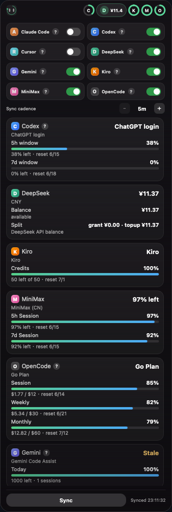

# ThatIsOK

> Desktop approval & usage cockpit for AI coding agents — floating, local, no telemetry.

ThatIsOK is a **floating island** that lives on your desktop. It intercepts permission requests from Claude Code and Codex, and tracks usage balances across all your AI coding tools in one glance.

<p align="center">
  
  
</p>

## What it does

- **Permission approval** — approve, approve-always, or deny tool-use requests without tabbing back to terminal
- **Usage tracking** — real-time progress bars for session / weekly / monthly quotas across providers
- **Balance sync** — stays current with provider APIs so you know when you're about to run out
- **Always on top** — a transparent, draggable island that never gets buried under other windows

## Supported providers

### Approval (hook bridge)

| Agent | Status | Setup |
|-------|--------|-------|
| Claude Code | ✅ | Auto-injected on startup |
| Codex | ✅ | Auto-injected on startup |
| OpenCode | ✅ | Plugin install required ([see below](#opencode)) |

### Usage & balance

| Provider | Tracks | Source |
|----------|--------|--------|
| Codex | 5h / 7d rate limits | Local auth + session files |
| Claude Code | Session cost | Local JSONL transcripts |
| Cursor | Usage summary | Local app storage |
| Gemini | Usage data | Local login + session data |
| DeepSeek | API balance | `DEEPSEEK_API_KEY` |
| MiniMax | Token plan balance | `MINIMAX_API_KEY` |
| OpenCode Go | $12/$30/$60 limits | Local SQLite (`opencode.db`) |
| OpenCode Zen | Model availability | OpenCode API key |

## Install

### From release (recommended)

Download the latest `.dmg` (macOS) or `.exe` (Windows) from [Releases](https://github.com/JaikenWong/ThatIsOK/releases).

**macOS users:** the app is not Apple-notarized. After installing, run this once to bypass Gatekeeper:

```bash
xattr -cr /Applications/ThatIsOK.app
```

Alternatively, right-click the app in Finder → **Open**.

### From source

```bash
git clone https://github.com/JaikenWong/ThatIsOK.git
cd ThatIsOK
npm install
npm run tauri:dev     # dev
npm run tauri:build   # release build → src-tauri/target/release/bundle/
```

**Prerequisites:** Node.js 18+, Rust toolchain (rustup), and platform build tools (Xcode on macOS, MSVC on Windows).

## Usage

### The island

| Mode | What you see |
|------|-------------|
| **Collapsed** | Logo + provider progress rings. Each ring is a provider; fill = quota used. Hover circles for exact numbers, hover `?` badges for setup tips. |
| **Expanded** | Click the island to expand. Full panel with toggle switches (show/hide providers), per-provider progress bars with dollar amounts and reset times, session logs, sync cadence setting. Click outside or toggle to collapse. |

### Global shortcuts

| Shortcut | Action |
|----------|--------|
| `Ctrl/Cmd+Shift+Space` | Toggle island visibility |
| `Ctrl/Cmd+Opt+A` | Approve current permission request |
| `Ctrl/Cmd+Opt+L` | Approve always (persistent rule) |
| `Ctrl/Cmd+Opt+D` | Deny current permission request |

### Tray menu

Right-click the tray icon (macOS menu bar / Windows system tray) for **Open**, **Sync Now**, and **Quit**.

## How hooks work

On startup, ThatIsOK writes managed entries into:

- `~/.claude/settings.json`
- `~/.codex/hooks.json`

When a tool-use permission is requested, the agent invokes the ThatIsOK binary with `--hook-source` and `--hook-event`. A TCP server on `127.0.0.1:45873` receives the event, displays the approval panel, and returns the decision.

### OpenCode plugin

Copy `src-tauri/plugins/thatisok-opencode.js` to `~/.config/opencode/plugins/`, then add to `~/.config/opencode/config.json`:

```json
{ "plugin": ["file:///Users/YOU/.config/opencode/plugins/thatisok-opencode.js"] }
```

## Configuration

- **Sync interval** — expand the island, use `+/-` buttons in the settings row (5 / 10 / 15 / 30 / 60 minutes)
- **Provider visibility** — toggle switches in the expanded panel; hidden providers are excluded from rings and card list
- **Approval rules** — "Approve Always" creates persistent rules stored in `~/.config/ThatIsOK/approval-rules.json`
- **Hide from Dock** — macOS: app runs as accessory, tray-icon only. Windows: `skipTaskbar` by default.

## Privacy

- All data is **local** — no telemetry, no cloud sync, no analytics
- Provider credentials are read from their standard locations (`.codex/auth.json`, `~/.local/share/opencode/auth.json`, `DEEPSEEK_API_KEY`, etc.) and **never transmitted** except to the provider's own API for balance queries
- Hook events are processed on local TCP and immediately discarded

## Troubleshooting

| Problem | Check |
|---------|-------|
| Provider shows "Stale" | Re-login to the provider, then click **Sync** |
| No usage bars appear | Provider may need a local login before data is available — hover the `?` badge for setup instructions |
| Ring shows half / cut off | Reduce number of visible providers; max 5 rings fit in collapsed mode |
| Hooks not working | Restart the coding agent after ThatIsOK has started |
| Island not showing | `Ctrl/Cmd+Shift+Space` toggles visibility; check tray icon |

## Tech stack

- **Desktop framework:** [Tauri 2](https://tauri.app) (Rust + webview)
- **Frontend:** vanilla JS + CSS in a transparent webview
- **Storage:** local JSON files, SQLite (for OpenCode Go history)
- **IPC:** Tauri commands + local TCP server for hook bridge

## Platform

| Platform | Status |
|----------|--------|
| Windows | Primary target |
| macOS | Fully supported |
| Linux | Not tested (contributions welcome) |

## License

ISC

---

[中文文档](./README.zh-CN.md) · [Windows 检查清单](./docs/windows-validation-checklist.md)
